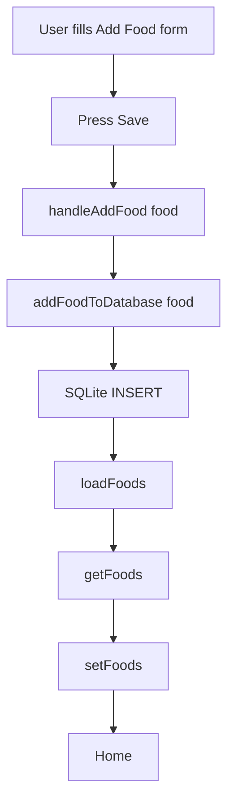
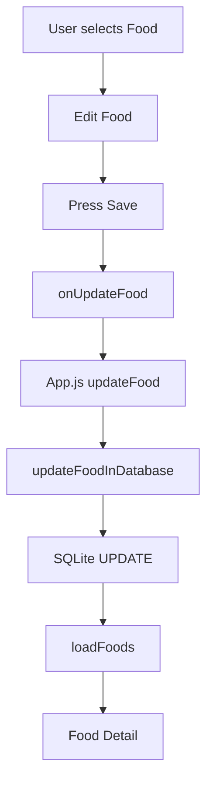
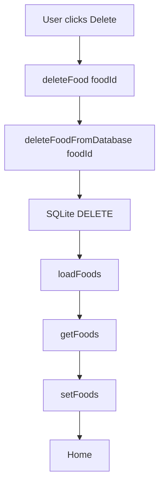
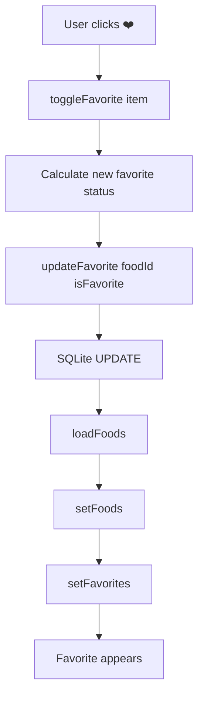
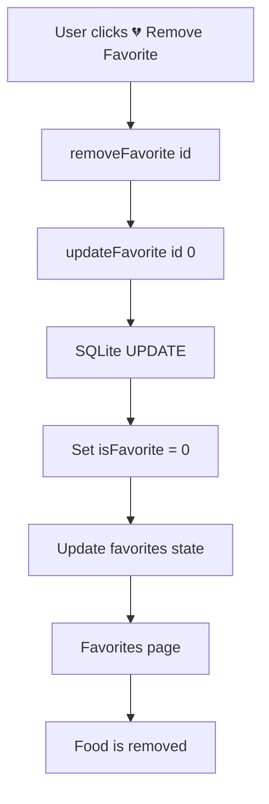
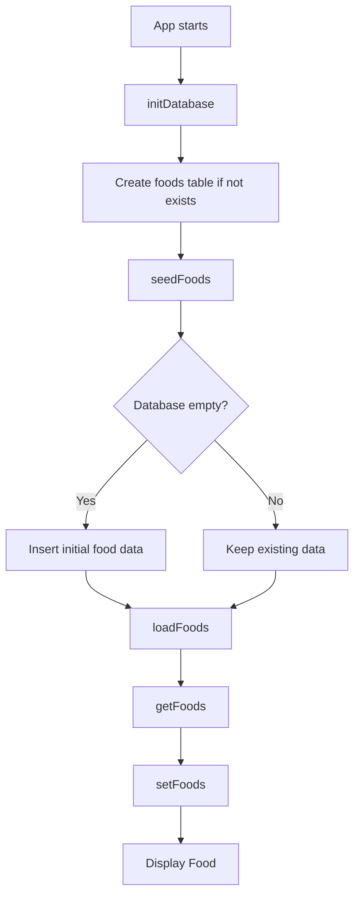
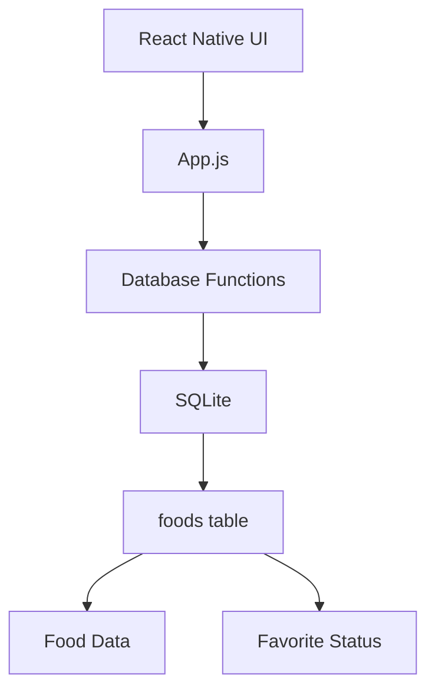
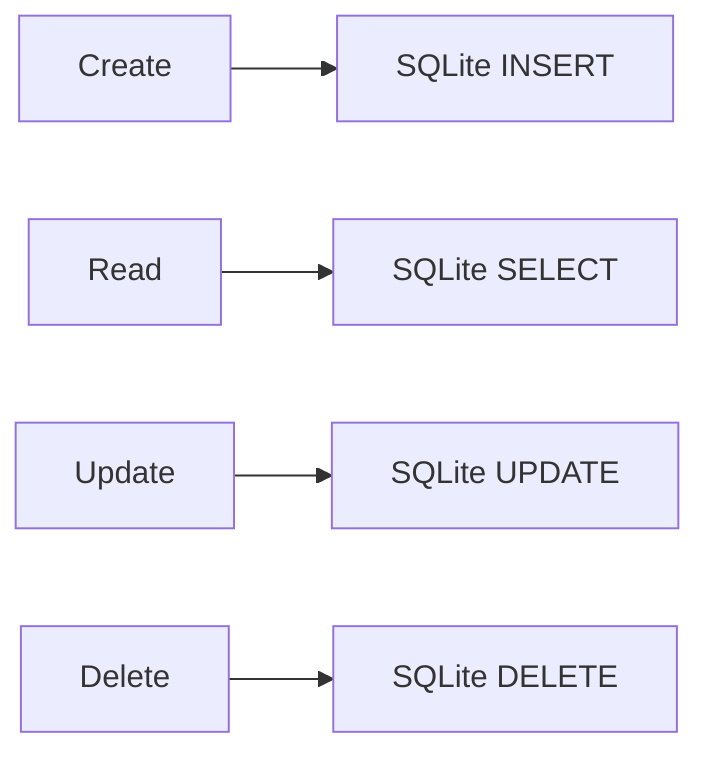
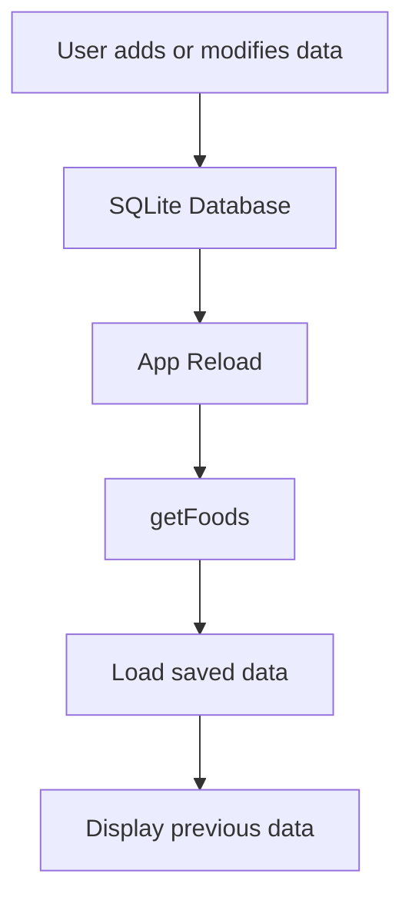

# Database Flow

This document describes the database flows used in the BLA2 Food Tracking App.

---

## 1. Save Food Flow

---

## 2. Edit Food Flow

---

## 3. Delete Food Flow

---

## 4. Add Favorite Flow

---

## 5. Remove Favorite Flow

---

## 6. Database Initialization Flow

---

## 7. Overall Database Architecture

---

## CRUD Summary

---

## Data Persistence

